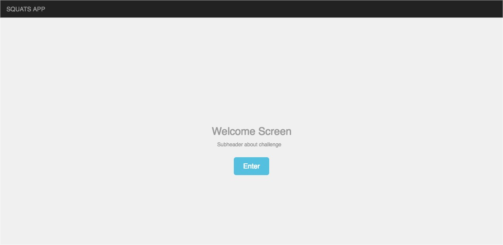

# Squats App Planning
### 💪 A Team Workout App Built in React

##### by Ginger Lee Kretschmer -- _March 2nd 2018_

## Project Description

This a socially-minded team workout application that allows a group of users (a team) to join a 21-day workout challenge. The challenge is composed of a curated list of free youTube videos, one for each day. After the workout is complete the user will add their name to the list of teammates who have completed the day's workout. Users will see all teammates who have completed the day’s workout.

The goal of this app is to leverage free workout content to a group of interested people and for them to be able to hold themselves accountable for the workout by seeing who has complete the workouts.

**Backstory**: The user in mind is a new mom who does not have much time to leave the house, who wants to get back in shape, and who also is on a budget. This is the very situation I was in last summer, and found myself using free youtube workout videos to get in short and quick home workouts, but without paying or being in a studio, it was hard to keep fully motivated and accountable. That experience and slight challenge to stay committed to the workouts gave me the idea to build a team workout app that uses the social aspect of a team to keep each other motivated. I am excited to build this because it encourages people to be active and healthy, and also builds community -- and it's fun!

## Project Proposal

### Minimum Viable Product Features
_A list of the absolute minimum features the project requires to meet_

#### Start Page:
* **Splash Page to Enter Site:** User will be presented with a landing page with a few different pieces of information about the challenge and a button to enter the site.

#### HomePage:
* **See User Name logged in:** User will be able to see their name logged in at the top of the screen at all times. This initially will be hardcoded. Logging in and out will be additional features after MVP.

* **See Challenge Details:** Users will be able to view details of challenge.

* **See Video List:** Users will be able to view all videos in a list for the challenge.

* **See Team List:** Users will be able to view all team members signed up for the challenge.

* **Click into any workout:** Users will be able to click any workout detail and be taken to a detail page (see below).

#### Workout Detail Page:
* **View workout details:** Users will be able to view workout details, e.g. equipment, duration, intensity level, muscle group focus, etc. (these are hardcoded and stored in Firebase in the video object).

* **Play video:** Users will be able to view and play the video of the day within the application in an iframe (iframe controls will allow user to play, pause, volume). Video will be stored in Firebase and will use a YouTube API.

* **Mark workout as completed:** Users will be able to mark the workout completed. This action will add user name to the team leaderboard which shows who in the team has marked that workout completed.

* **View team leaderboard:** User will be able to see which teammates, including themselves, have completed the workout video of the day.

### Tools, frameworks, libraries, APIs for MVP
* React
* Redux
* Webpack
* JSX
* Jest
* React Youtube NPM
* Firebase
* CSS

#### **If you finish developing the minimum viable product (MVP) with time to spare, what will you work on next? Describe these features here: Be specific.**

* **User Login** - Allow user to login to application using a join challenge button. Perhaps with Auth0. This will allow for multiple users.

* **Show user progress/status** on homepage team section for the challenge - stats on how many workouts they have completed

* **View previous/next video page** - from video detail page, navigate to next and previous video pages.

* **Mobile** Rebuild App in React Native

* **Build user profile page**, that will show and allow for editing user information (name, image, tagline), show which workouts they have completed.

* **Create Challenge Badges** for final workout/challenge completion.
* **Create Multiple Challenges** Create other challenges user can join!

#### What additional tools, frameworks, libraries, APIs, or other resources will these additional features require?
* React Native
* React Native YouTube feature
* Auth0
* React Native Styling - probably Bootstrap

## UX/UI Layout

#### Welcome Screen

#### Challenge Home Screen

#### Workout Detail Screen

## UX/UI Layout With Component Annotations

#### Welcome Screen With Component Annotations

#### Challenge Home Screen With Component Annotations

#### Workout Detail Screen With Component Annotations

## Component Tree

## Building Process

1. Break the UI into a Component Hierarchy
  * Add the visual representation of layout/appearance and a component tree diagram)
2. Build A Static Version in React
  * Link to static site repo here: [Static Squats App](https://github.com/gingerlee/squats-app)
3. Identify The Minimal (but complete) Representation Of UI State
  * Add a list of state slices application requires and how they will be structured to planning repo before moving to the next step.
4. Lifting State: Identify Where Your State Should Live
  * Before advancing identify where your state will be lifted in your planning repo. You could do this in a list, by adding indicators to your component diagram, or any other format. Then, add that state to your static project.
5. Add Inverse Data Flow
